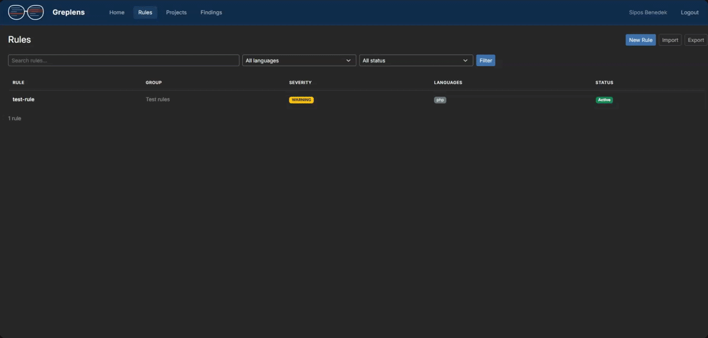
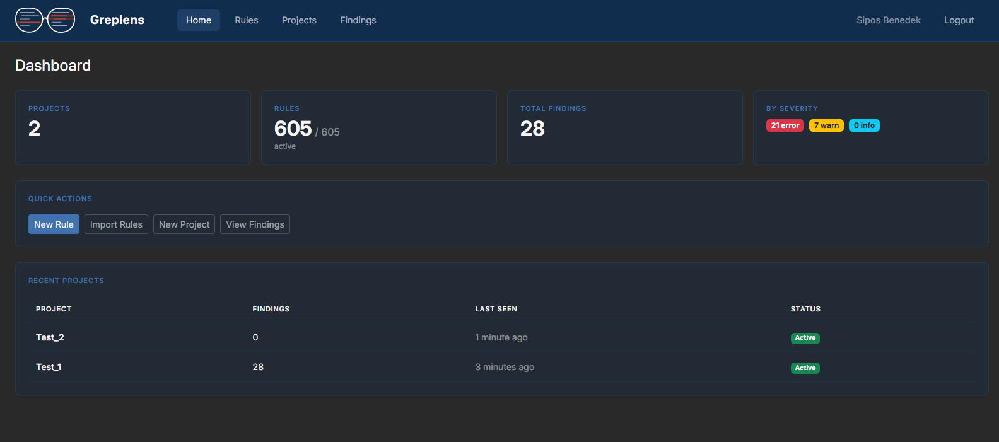
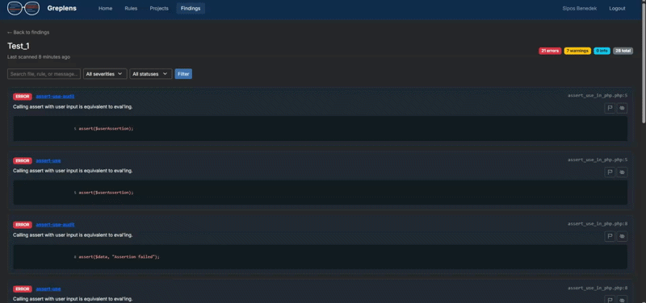

# Greplens

A self-hosted web application for managing [OpenGrep](https://opengrep.dev/) security rules, running scans against your projects, and reviewing findings - all from a single dashboard.

Inspired by tools like Semgrep Cloud, but designed for self-hosted OpenGrep workflows.

## Status

This project is under active development. Feedback and contributions are welcome.

## Features

- **Rule Management** - Create, edit, import, and export OpenGrep rules with a built-in YAML editor  
- **Live Rule Testing** - Write a rule and test it against sample code directly in the browser  



- **Project-based Scanning** - Register projects with API keys and push scan results from CI/CD pipelines  
- **Findings Dashboard** - Browse findings by project, filter by severity/status, compare historical scans  



- **Finding Triage** - Flag or suppress findings to track review progress  



- **Rule Export API** - Fetch active rules as YAML for use in CI pipelines with a single command  

---

## Typical Workflow

1. Create rules in Greplens  
2. CI fetches rules via API  
3. OpenGrep scans the project  
4. Results are sent back to Greplens  
5. Developers triage findings in the dashboard  

---

## Requirements

- PHP 8.3+  
- Composer  
- MySQL 8.0+ (or MariaDB 10.5+)  
- [OpenGrep CLI](https://opengrep.dev/) (optional, for live rule testing)  

If OpenGrep is not installed, live rule testing in the UI will be disabled, but all other features (rule management, CI scanning, dashboard) will continue to work.

---

## Installation

### Quick Start

```bash
git clone https://github.com/SiposBenedek/greplens.git
cd greplens
composer install
cp .env.example .env
php artisan key:generate

# configure DB in .env

php artisan migrate
php artisan make:user

php artisan serve
```

If `php artisan serve` does not work on your system (e.g. Windows restrictions), you can use:

``bash
php -S localhost:8000 -t public
``

Then open: http://localhost:8000

---

### Configuration

Set your database credentials in `.env`:

```env
DB_DATABASE=greplens
DB_USERNAME=root
DB_PASSWORD=secret
```

If you have OpenGrep installed, enable it:

```env
OPENGREP_ENABLED=true
OPENGREP_BINARY=PATH_TO_BINARY
```

---

## Docker

Docker support is planned but not yet available.

---

## Usage

### Managing Rules

Rules can be created manually through the web UI or bulk-imported from ZIP files. Each rule has a YAML definition following the OpenGrep rule syntax. The built-in editor lets you test rules against sample code before activating them.

### Setting Up a Project

1. Go to **Projects** and create a new project  
2. Copy the API key
3. Use the API key to push scan results from your pipeline  

(API keys are only shown once when the project is created.)

---

### CI/CD Integration

Run the following commands in your pipeline using your project’s API key:

```bash
# Fetch rules from your Greplens instance and run them on the project
opengrep scan --config http://your-instance/api/rules?key=glp_xxxx --json-output results.json -q

# Post the findings to Greplens
curl -X POST http://your-instance/api/findings \
  -H "Content-Type: application/json" \
  -H "X-Api-Key: glp_xxxx" \
  -d @results.json
```

---

### API Endpoints

| Method | Endpoint        | Auth    | Description                     |
|--------|----------------|---------|---------------------------------|
| GET    | /api/rules     | API Key | Export active rules as YAML     |
| POST   | /api/findings  | API Key | Push scan results               |

Authentication is supported via:
- `X-Api-Key` header  
- `Authorization: Bearer` header  
- `?key=` query parameter  

---

## Testing

```bash
php artisan test
```

---

## License

[MIT](LICENSE)